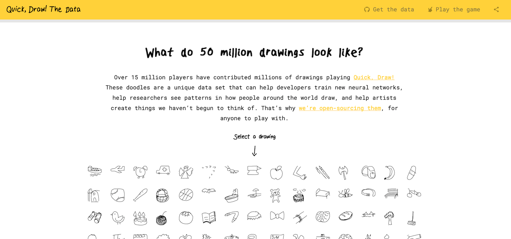
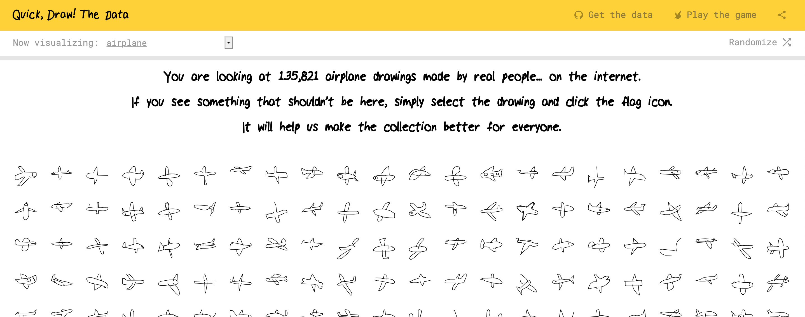

## Final ML Project: Emoji Classification
Riley Goodling - rgoodling3@gatech.edu

Haris Hussain - 

Yu Xin - 

Grace Armfield - 

### Introduction

Emojis have become an increasingly important feature in communication within the last decade. As the demand for emojis has increased, developers have created emojis for seemingly all images. Therefore, it can be difficult for users to find the emoji they are looking for. Our application aims to create a solution that will allow users to find their emoji by drawing a sketch of their desired emoji. This solution could also be applied to various text editor applications in which users’ sketches could be easily transformed into emojis that have already been designed.

### Data

Our data is coming from a doodle dataset that was provided by Google. The data set can be found here: https://quickdraw.withgoogle.com/data. Using the labeled images, we searched for images that alligned with existing emojis. We then had a list of 95 emojis that could be matched with doodles from the dataset. Google's doodle dataset had more than 100,000 doodles for most of the images, so this provided us with more than enough data to train and test on. 

The Google Doodle Website looks like this:

And an example of an image's page looks like this:

### Approach

To perform this image classification task efficiently, we plan to retrain an existing neural network architecture. Our approach is based on Convolutional Neural Network architecture (ConvNet) with ReLU activation function. It consists of five basic types of layers: convolution layer, ReLU layer, pooling layer, flattening layer, and fully connected layer. It is a widely applied architecture in the field of image recognition, offering high accuracy under reasonable training time. In particular, its ability to detect edge arrangements is ideal for simple hand-drawn figures in our project. Also, the trained neural network provides fast image classification speed, which is ideal for situations such as note-taking and texting. To achieve this, we retrain a Deep Residual Network (ResNet) based on the Google Doodle dataset, a variant of ConvNet that weights residuals with manifolds of the dataset to improve image classification as demonstrated on Google Doodle.  Thus, we hope to observe the training and inference of ResNet on a dataset of 2D vector images.

### Results

### Conclusion
